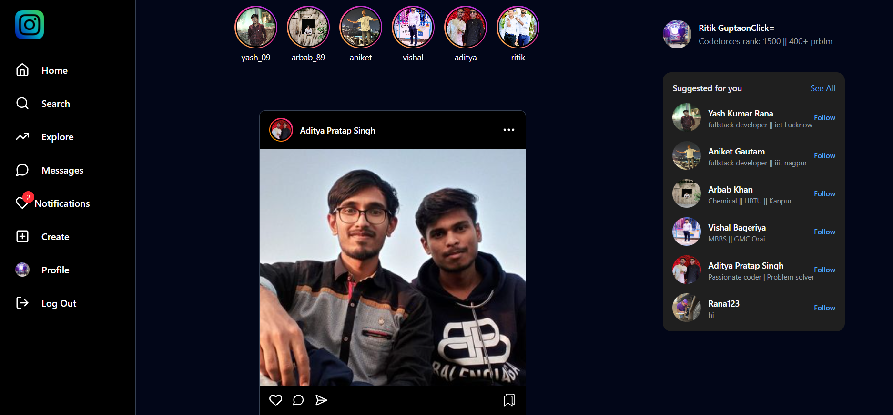
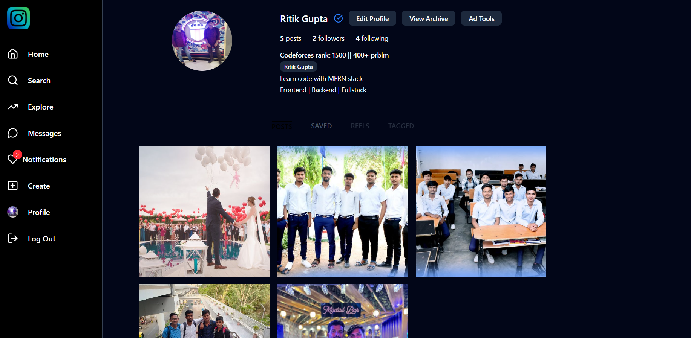
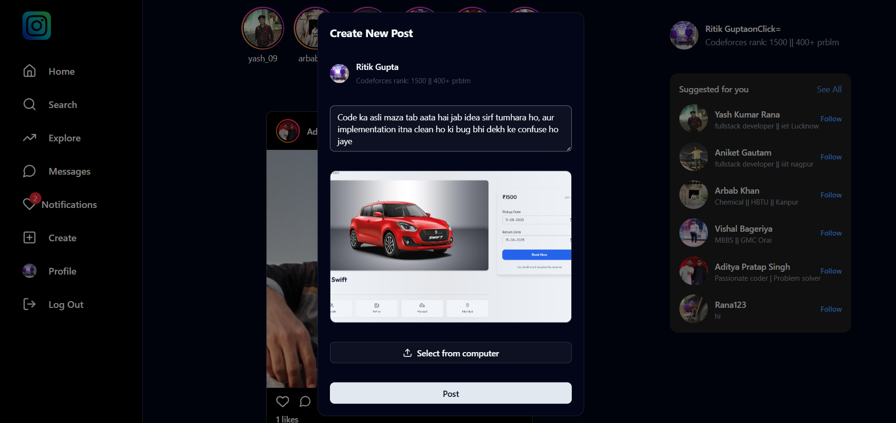
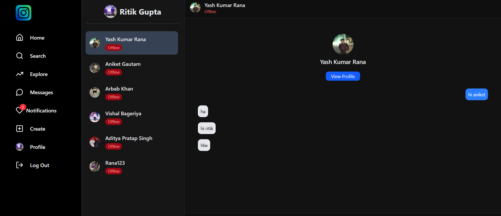
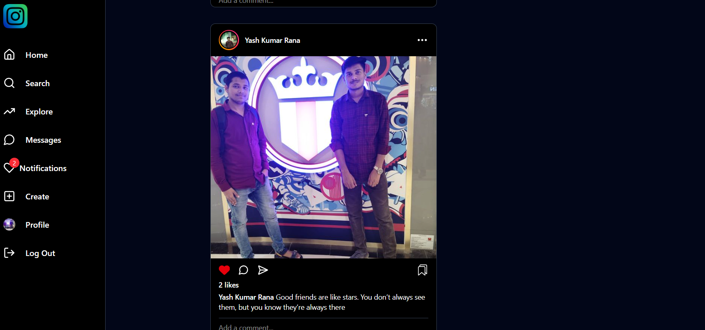
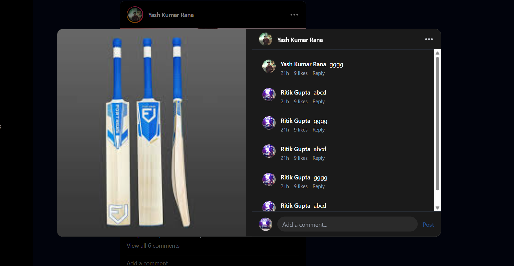

# 📱 Social Media MERN App

A full-stack **Social Media Application** built using the MERN Stack (MongoDB, Express.js, React.js, Node.js) with features like posting, commenting, liking, following/unfollowing, chatting, and real-time updates using Socket.io.


---

## 🚀 Live Demo

🔗 [View Live](https://car-booking-client-brown.vercel.app)

---

## 📸 Screenshots

| 🏠 Home Page | 👤 Profile Page | ➕ Create Post | 
|-------------|--------------------|-----------------|
|  |  |  | 


| 🏠 chat Page | 👤 Post Page | ➕ Comments Page | 
|-------------|--------------------|-----------------|
|  |  |  | 

---

## ✨ Features

### 👥 User Features
- User Authentication (Signup/Login)
- Create, like, dislike, comment, and delete posts
- Follow and unfollow other users
- View profiles with user posts
- Real-time likes and chat messages
- Protected routes for logged-in users
- Responsive design

### 💬 Chat & Messaging
- Real-time chatting with Socket.io
- Message history saved in MongoDB
- Notifications for new messages

---

## 🧰 Tech Stack

### 💻 Frontend
- React.js + Vite
- Tailwind CSS + Shadcn/UI
- Redux Toolkit (State Management)
- Axios (API calls)
- React Router DOM

### 🖥️ Backend
- Node.js
- Express.js
- MongoDB + Mongoose
- JWT Authentication
- Multer (image upload)
- Cloudinary (media storage)
- Socket.io (real-time communication)
---

## 📂 Folder Structure

```bash
social-media-app/
├── backend/          # Node.js + Express API
│   ├── config/       # DB and cloud configs
│   ├── controllers/  # API controllers
│   ├── models/       # Mongoose schemas
│   ├── routes/       # API routes
│   ├── middleware/   # Auth middlewares
│   ├── server.js     # Entry point
│
├── frontend/         # React + Vite App
│   ├── public/
│   └── src/
│       ├── components/
│       ├── pages/
│       ├── store/
│       ├── App.jsx
│       ├── main.jsx
│
└── README.md

```

---

## 🧰 Local Setup Instructions

### ✅ Requirements:
- Node.js installed
- MongoDB connection ( Atlas)

- Vite (comes with frontend)

---

### 1️⃣ Backend Setup

```bash
cd backend
npm install
```

Create a `.env` file in `/backend`:

```env
MONGO_URI=your_mongodb_connection_string
JWT_SECRET=your_jwt_secret
CLOUDINARY_CLOUD_NAME=your_cloud_name
CLOUDINARY_API_KEY=your_api_key
CLOUDINARY_API_SECRET=your_api_secret


```

Start the server:

```bash
npm start
```

---

### 2️⃣ Frontend Setup

```bash
cd ../frontend
npm install
```

Create a `.env` file in `/frontend`:

```env
VITE_BACKEND_URL=http://localhost:5000
VITE_IMAGEKIT_PUBLIC_KEY=your_imagekit_public_key


```

Start the frontend:

```bash
npm run dev
```

> Frontend runs at `http://localhost:5173`

---

## 👨‍💻 Author

**Yash Rana**  
🎓 IET Lucknow  
📧 yashrana097@gmail.com  
🔗 [LinkedIn](https://www.linkedin.com/in/yashrana52)  
💻 [GitHub](https://github.com/YashRana52)
